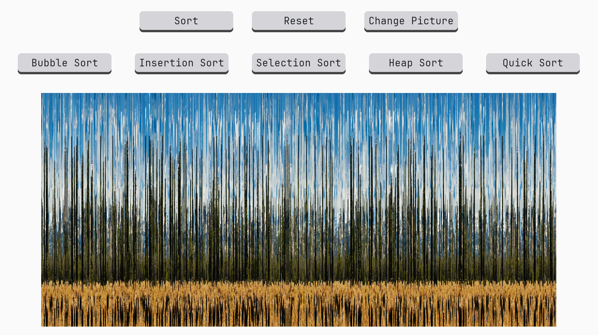

<h1 align="center"> 
Picture Sorter Visualization 📶
</h1>

 
  

<h2>
  📝 About the project
</h2>

  This project is a visualization of five different sorting algorithms using different pictures of nature. It shows how five different sorting methods (<b>Bubble Sort</b>, <b>Insertion Sort</b>, <b>Selection Sort</b>, <b>Heap Sort</b>, and <b>Quick Sort</b>) work using pictures. Although this is a more fun way of visualizing sorting algorithms, it is not the best visualization method when it comes to learning. It features 10 pictures of nature that can be sorted by pressing buttons with a desired algorithm of sorting.

<h2>
  🎥 Demo
  
</h2> 
<h2>
  📖 Getting Started
</h2>

  In order to start the program, you have to download the File <b>Picture Sorter Visualization</b>. It is very important that the following files are all in the same directory: <b>main.py</b>, <b>Pictures</b> and <b>Fonts</b>. The easiest method is just to download the File <b>Picture Sorter Visualization</b>.

<h2>
  🔨 How to use
</h2>

  After executing the program you will see a window with random unsorted picture of a nature. In order to see the sorting visualization process, you need to press a button selecting your desired sorting process. After that all you need to do is press the button 'Sort' and the sorting process will start. During the sorting process you can not pause it and you need to wait until the end of the process. After that you may reset the image or you can select next random picture of nature to sort.

